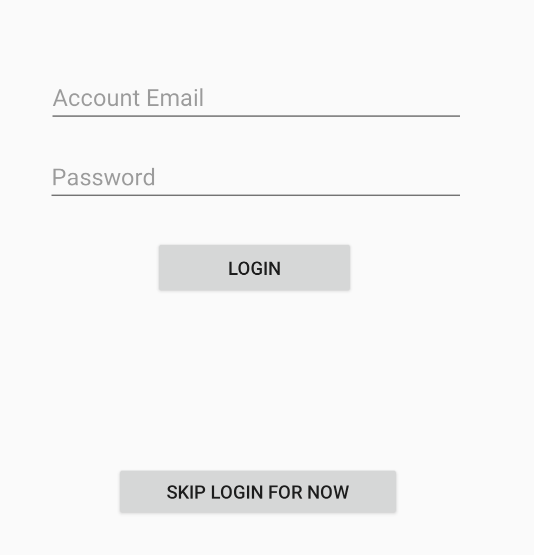
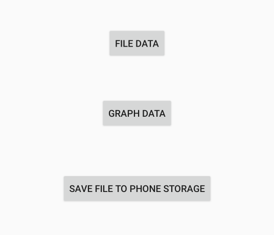
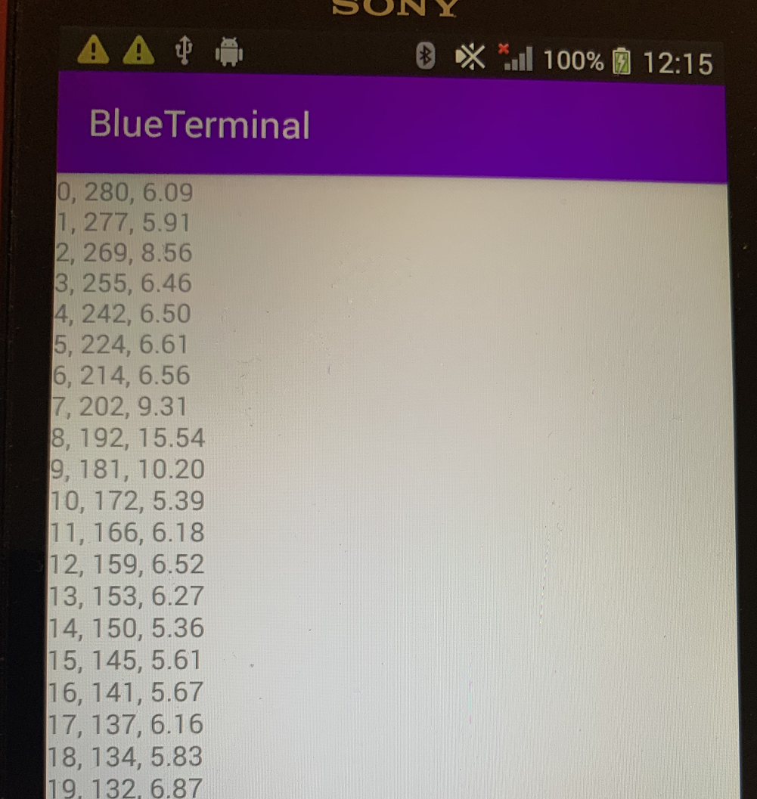
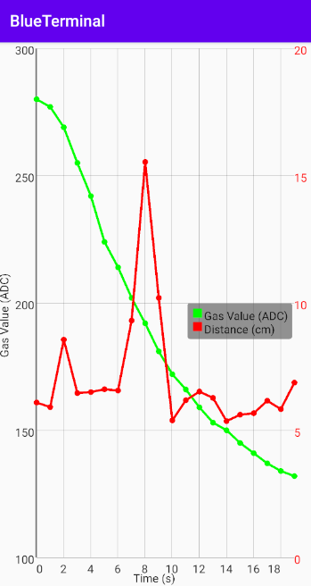

# BlueTerminal  
This guide is intended to help the people who wants to use the BlueTerminal app or reproducing what we achieves in ECE496. Please note: this project involves BlueTooth Low Energy (BLE), which requires the developer to run the app with an Android phone version 4.3 (API level 18) and higher have built-in platform support for Bluetooth Low Energy (BLE) in the central role.
## Project setup
* Project development environment: Android Studio: https://developer.android.com/studio
* Other related soruces: Firebase: https://firebase.google.com/
### Libraries Used
* Fundamental Libraries
  * [AppCompat](https://developer.android.com/topic/libraries/support-library/packages#v7-appcompat) - Degrade on older versions of Android.
  * [Data Binding](https://developer.android.com/topic/libraries/data-binding/) - Bind the data to UI component
  * [Lifecycles](https://developer.android.com/topic/libraries/architecture/lifecycle) - Use for creating an automatically responding lifecycle changes
  * [Navigation](https://developer.android.com/topic/libraries/architecture/navigation/) - Handle in-app navigation
  * [ViewModel](https://developer.android.com/topic/libraries/architecture/viewmodel) - Store UI-related data that isn't destroyed on app rotations. Easily schedule asynchronous tasks for optimal execution.
  * [Fragment](https://developer.android.com/guide/components/fragments) - A basic unit of composable UI.
  * [Layout](https://developer.android.com/guide/topics/ui/declaring-layout) - Lay out widgets using different algorithms.
* Core Libraries
  * [Bluetooth low energy]( https://developer.android.com/guide/topics/connectivity/bluetooth-le) - BLE is designed to provide significantly lower power consumption.
  * [GraphView](https://github.com/jjoe64/GraphView) - GraphView is a library for Android to programmatically create flexible and nice-looking diagrams. It is easy to understand, to integrate and to customize.
  * [Firebase](https://firebase.google.com/docs/android/setup) - Major Android phone Cloud provider
## Overview of Important Pages  
### User Firebase Login Page  
**Location**: https://github.com/RayZGit/BlueTerminal/blob/master/Android/app/src/main/java/com/ruizhou/blueterminal/Activity/userAuthActivity.java  
  
**Description**: The user can establish a connection with the cloud API in order to save data files to the cloud database. The user can also skip this authentication page while operating in an environment lacking an internet connection. If the user chooses to do so, the application will disable the cloud uploading functionality, maintaining the security and integrity of our data files in our cloud database.  
  
### Homepage
**Location**: https://github.com/RayZGit/BlueTerminal/blob/master/Android/app/src/main/java/com/ruizhou/blueterminal/Activity/MainActivity.java  
  
**Description**: The user can either turn on or off their phone’s bluetooth as well as scan for available bluetooth devices in close proximity. All the available bluetooth devices will also be displayed on the homepage, and the user can connect to them individually by clicking the “connect” button. Once the connection is established, the user can click the device tab, which sends the user to the **Device Details Page** in order to perform send and receive operations with the connected device.  
  
### Device Details Page
**Location**: https://github.com/RayZGit/BlueTerminal/blob/master/Android/app/src/main/java/com/ruizhou/blueterminal/Activity/DetailActivity.java  
  
**Description**: The user can upload files from external storage to the cloud database using the “Upload files to cloud” button. The button's implementation can be found at https://github.com/RayZGit/BlueTerminal/blob/master/Android/app/src/main/java/com/ruizhou/blueterminal/Activity/DetailActivity.java#L161-L179.  
The user can press the “View Arduino files” button to send the LIST command to the connected Bluetooth device. When Arduino receives this command, it will send back a list of all the sensor reading file names currently available on the Arduino’s MicroSD card, and this information is stored in _filelist.txt_. Implementation found at https://github.com/RayZGit/BlueTerminal/blob/master/Android/app/src/main/java/com/ruizhou/blueterminal/Activity/DetailActivity.java#L132-L159. This button will take the user to the **File List Page**.  
The user can send custom commands using the text input box and "Submit" button, and view received data using "Receive".  
  
### File List Page
**Location**: https://github.com/RayZGit/BlueTerminal/blob/master/Android/app/src/main/java/com/ruizhou/blueterminal/Activity/FileList.java  
  
**Description**: The user can either selectively retrieve individual files by pressing their respective button labeled with their filename, or press the “Dump” button to retrieve all the data files that have not yet been retrieved. The individual file buttons are generated dynamically from the filenames in _filelist.txt_, and implementation can be found at https://github.com/RayZGit/BlueTerminal/blob/master/Android/app/src/main/java/com/ruizhou/blueterminal/Activity/FileList.java#L93-L126. The "Dump" button's implementation can be found at https://github.com/RayZGit/BlueTerminal/blob/master/Android/app/src/main/java/com/ruizhou/blueterminal/Activity/FileList.java#L133-L178. Should the user press a specific file button, they will be taken to the file's **File Details Page**.  
  
### File Details Page
**Location**: https://github.com/RayZGit/BlueTerminal/blob/master/Android/app/src/main/java/com/ruizhou/blueterminal/Activity/GraphData.java  
  
**Description**: The "File Data" button takes the user to the **File Content Display Page**. The "Graph Data" button takes the user to the **File Graphing Display Page**. The "Save file to Phone Storage" button saves the file to the Android phone’s external storage. This is important because it allows the user to save files to the Android phone’s external storage where they will persist outside of the mobile app. Then users can easily upload these files to the cloud database via **Device Details Page** later when they obtain an internet connection.
  
### File Content Display Page
**Location**: https://github.com/RayZGit/BlueTerminal/blob/master/Android/app/src/main/java/com/ruizhou/blueterminal/Activity/DisplayData.java  
  
**Description**: The user can view the file content in text form.  
  
### File Graphing Display Page
**Location**: https://github.com/RayZGit/BlueTerminal/blob/master/Android/app/src/main/java/com/ruizhou/blueterminal/Activity/Graphing.java  
  
**Description**: The user can view the plotted multiple-line graph of the file content.
