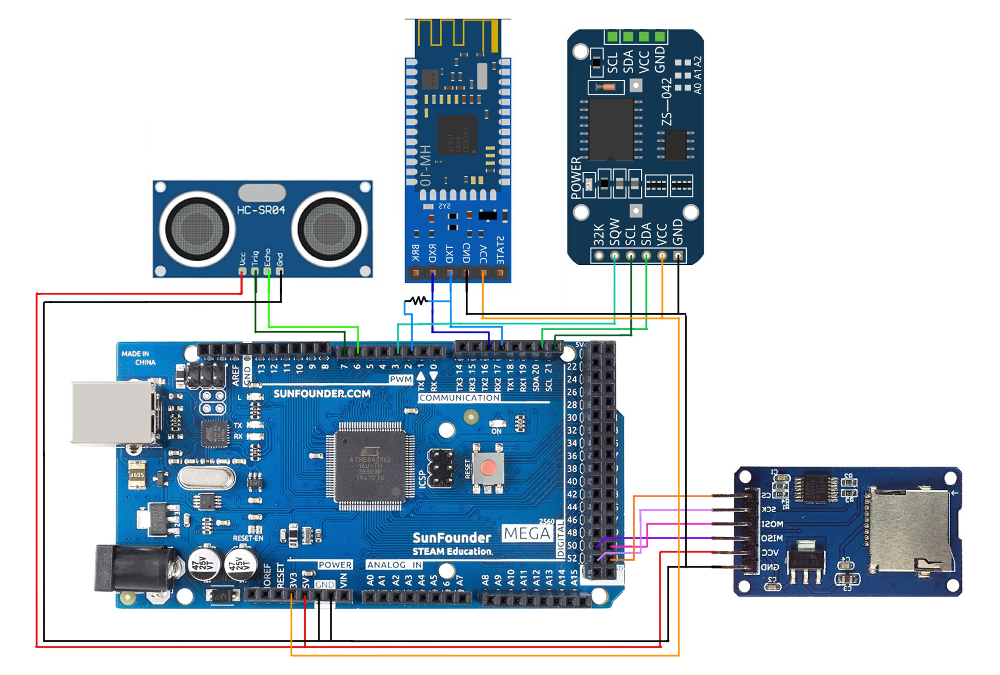
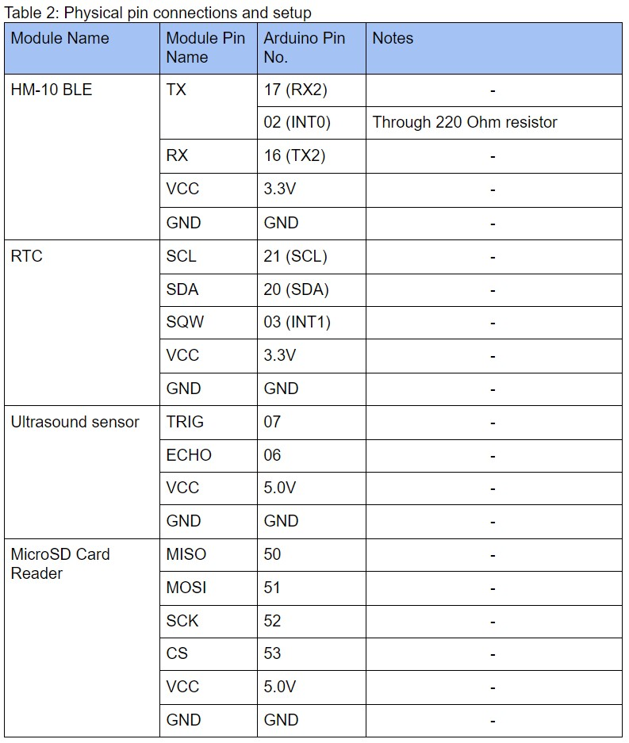
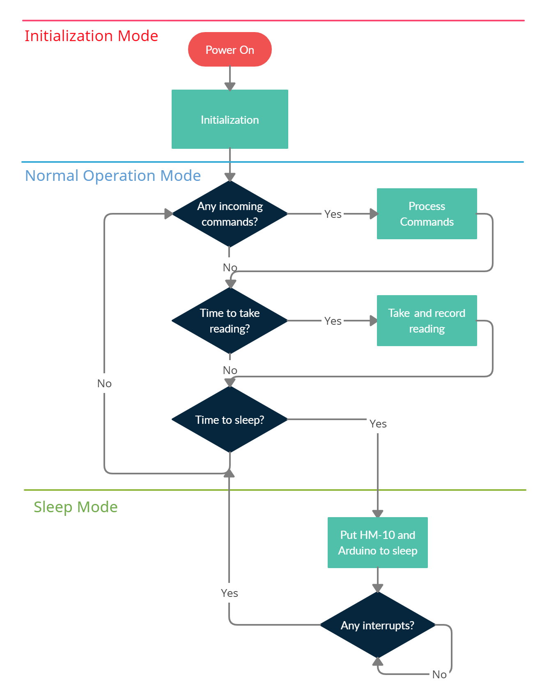
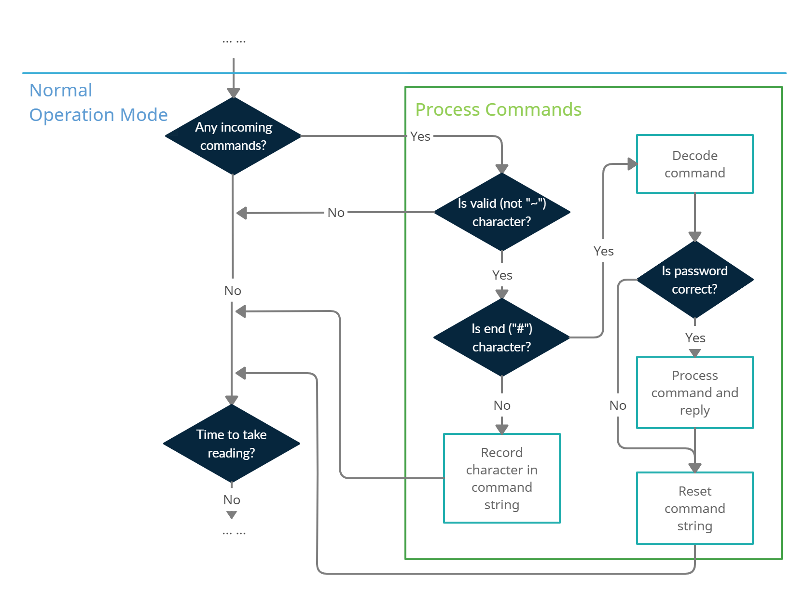

# Arduino

## Physical Setup

## Operations

## Folder structure

- Code -- Contains all arduino code for the above layout. Download and open .ino file with Arduino IDE.
- Libraries -- Contains the necessary libraries for the code provided. Download and move into the folder C:\Users\\\<Username\>\Documents\Arduino. May be different depending on preference, you can verify in Arduino IDE (File -> Preference -> Sketchbook location).

## Code documentation
This section briefly introduces what each function in each file does. Comments are included in the actual code.

### Arduino.ino
Main entry of the code.
- void setup(): Initializes Serial1 for debug as well as necessary interrupt pins.
- void loop(): Performs the operational flow as shown by the diagram above. Bluetooth and sensors are described in HM10 and Ultrasound below. Arduino will go into sleep mode after a predefined period of inactivity (no communications and no data readings taken, note that long communications are not a problem and the Arduino will not sleep during a communication).
- void HM10_To_Sleep(): Helper function that puts the HM-10 module to sleep. Will disconnect user.
- void Mega2560_To_Sleep(): Helper function that puts the Arduino to sleep. Interrupts are enabled here and instruction execution will resume here.
- void wakeUp(): Interrupt routine for waking up the arduino and disabling interrupts.
- void flushSerial2(): Helper function that flushes the Serial2 (HM-10) buffer.

### HM10.h/cpp
- void init_HM10(): Performs initialization for Serial2 (Mega2560), configures name for module.
- void process_command(): Checks for incoming data recieved by HM-10, if present and valid password, process command, else ignore and disconnect user. Following diagram highlights the processing: 
- String getValue(String data, char separator, int index): Helper function that breaks up incoming command into processable tokens.

### MicroSD.h/cpp
- void init_MicroSD(): Verifies that the MicroSD card reader module is operational and CS (chip select) pin is connected. Also creates a new data file depending on the day's date, a new datafile is created each day.
- String getDateStringFilename(const RtcDateTime& dt): Helper function that returns a string of today's date. Max length capped at 8 characters to conform to 8.3 file format standards used by Arduino. Violating this standard causes file creation to fail.
- void printDirectory(File dir, int numTabs): Helper function that iterates through all files and prints out the file names. Used to implement "LIST" command.

### RTC.h/cpp
- void init_RTC(): Initializes RTC with current time (system time upon compilation). Also configures alarm 2 (alarm 1 has second resolution, alarm 2 has minute resolution, more details at https://github.com/Makuna/Rtc). Currently configured to 1 minute.
- void printDateTime(const RtcDateTime& dt): Helper function that prints current time.
- void print_time(): Wrapper around above function that performs additional RTc integrity checks and prints time every second.

### Ultrasound.h/cpp
- long ultrasoundTakeReading(): Function that takes a reading from the ultrasound sensor.
- long microsecondsToInches(long microseconds): Helper function that converts ms readings to inches.
- long microsecondsToCentimeters(long microseconds): Helper function that converts ms readings to centimeters.
-void save_reading(double reading, double inches, double centimeters): Takes the readings and saves to MicroSD card. Also checks if a day has elasped and will create a new datafile if necessary. 