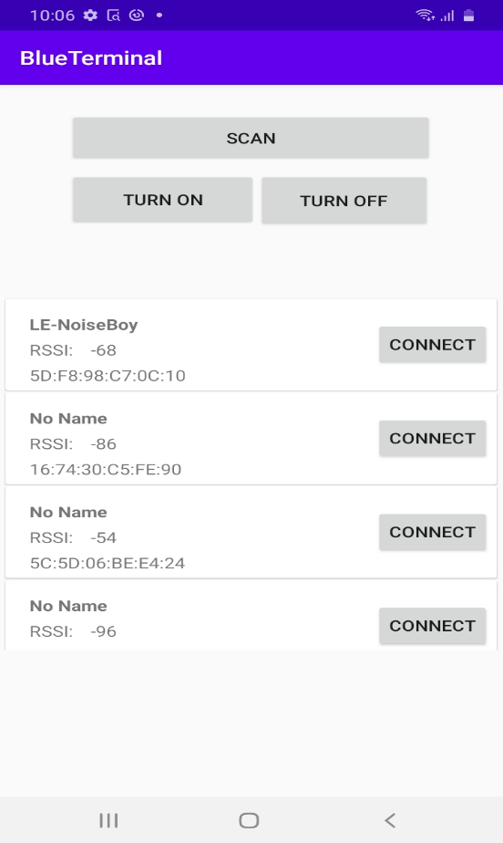
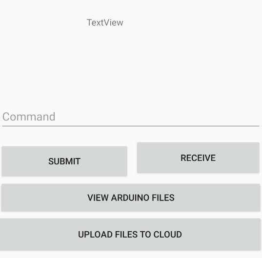
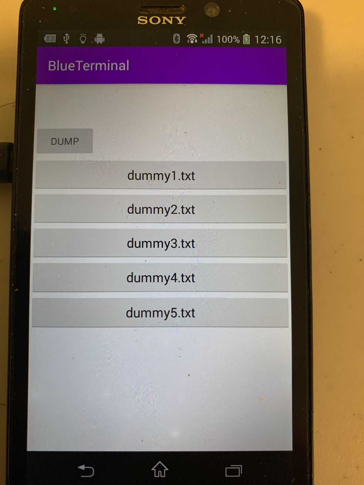

# BlueTerminal
## Overview of Important Pages
### User Firebase Login Page
Location: https://github.com/RayZGit/BlueTerminal/blob/master/app/src/main/java/com/ruizhou/blueterminal/Activity/userAuthActivity.java

### Homepage
Location: https://github.com/RayZGit/BlueTerminal/blob/master/app/src/main/java/com/ruizhou/blueterminal/Activity/MainActivity.java

### Device Details Page
Location: https://github.com/RayZGit/BlueTerminal/blob/master/app/src/main/java/com/ruizhou/blueterminal/Activity/DetailActivity.java

### File List Page
Location: https://github.com/RayZGit/BlueTerminal/blob/master/app/src/main/java/com/ruizhou/blueterminal/Activity/FileList.java

### File Details Page
Location: https://github.com/RayZGit/BlueTerminal/blob/master/app/src/main/java/com/ruizhou/blueterminal/Activity/GraphData.java

### File Content Display Page
Location: https://github.com/RayZGit/BlueTerminal/blob/master/app/src/main/java/com/ruizhou/blueterminal/Activity/DisplayData.java

### File Graphing Display Page
Location: https://github.com/RayZGit/BlueTerminal/blob/master/app/src/main/java/com/ruizhou/blueterminal/Activity/Graphing.java

